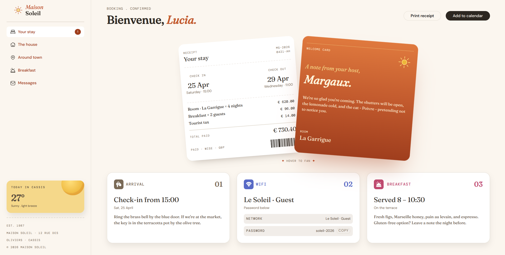
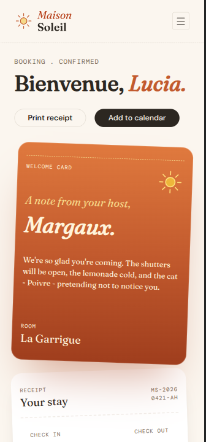

# Frontend Mentor - Four card feature section solution

This is a solution to the [Hotel booking confirmation page](https://www.frontendmentor.io/challenges/hotel-booking-confirmation-page). Frontend Mentor challenges help you improve your coding skills by building realistic projects.

## Table of contents

- [Overview](#overview)
  - [The challenge](#the-challenge)
  - [Screenshot](#screenshot)
  - [Links](#links)
- [My process](#my-process)
  - [Built with](#built-with)
  - [What I learned](#what-i-learned)
- [Author](#author)

## Overview

### The challenge

Users should be able to:

- View the optimal layout for the site depending on their device's screen size

### Screenshot




### Links

- Solution URL: [Solution URL](https://github.com/Sandy-SandBox/hotel-booking-confirmation-page)
- Live Site URL: [Live site URL](https://sandy-sandbox.github.io/hotel-booking-confirmation-page-main))

## My process

### Built with

- Semantic HTML5 markup
- CSS custom properties
- CSS Flexbox
- CSS Grid
- Mobile-first workflow

### What I learned

This challenge was harder than i expected. There were many minute details that you don't notice the first time you take a look at the design. Not having the figma design files makes it even harder but i can't complain. Initially, i had to play around the HTML structure until i finally settled with grid to create the main/overall layout.

The biggest obstacle was making the mobile navigation without using JavaScript. Although i can write a few lines of JS, i challenged myself to do it without JS. Css `:has` property is just magic, it saved my life.

I used a label paired with a `<input type="checkbox" id="nav-toggle" />` and used the `:has` property's magic:

```css
#nav-toggle,
.header__menu-icon--close {
  display: none;
}

.main:has(#nav-toggle:checked) .header__menu-icon--close {
  display: block;
}
.main:has(#nav-toggle:checked) .header__menu-icon--open {
  display: none;
}
```

## Author

- Website - [Sushant](https://sushantz.netlify.app/)
- Frontend Mentor - [@Sandy-SandBox](https://www.frontendmentor.io/profile/Sandy-SandBox)
